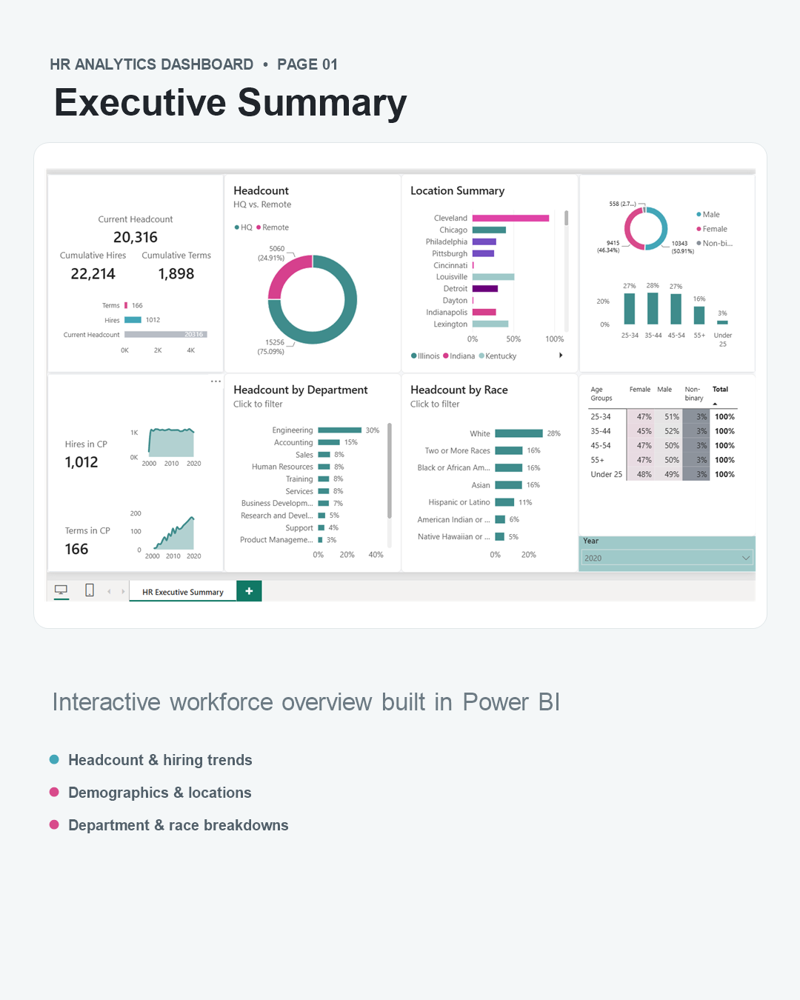
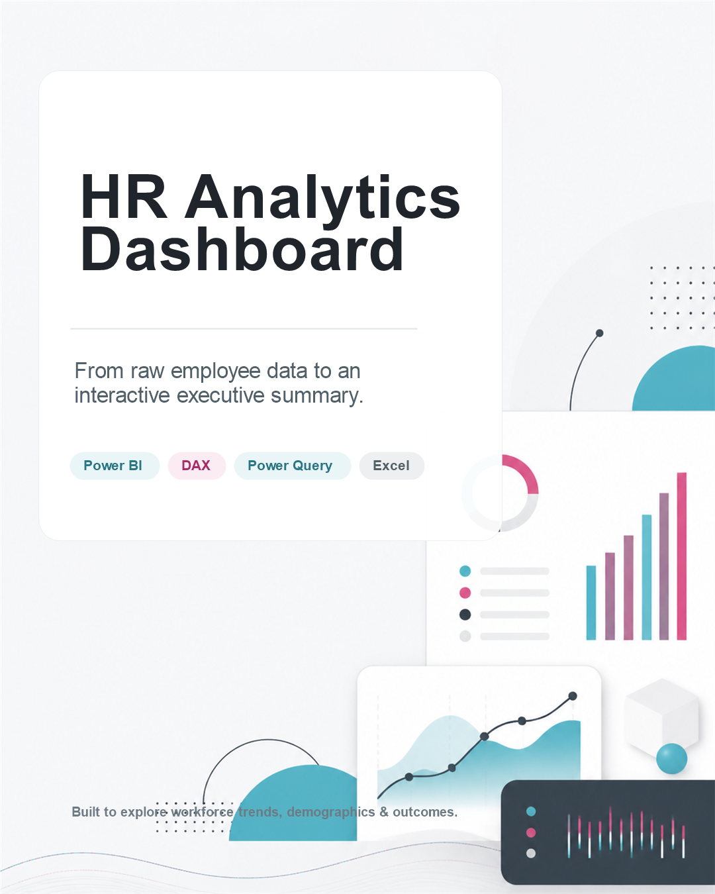

# HR Analytics Dashboard | Power BI

An executive-ready Power BI dashboard that transforms employee records into a clear view of workforce composition, hiring activity, and organisational trends.

## Dashboard purpose
This dashboard is designed to help HR teams and business leaders quickly understand:
- current headcount, cumulative hires, and cumulative terminations;
- hiring and termination activity in the selected period;
- workforce distribution across locations and HQ versus remote work;
- demographic representation by gender, age group, and race; and
- department-level workforce composition.

## Tools used
`Power BI` · `DAX` · `Power Query` · `Excel`

## Project files
| File | Description |
| --- | --- |
| `HR Analytics Dashboard.pbix` | Power BI report source file |
| `linkedin-carousel-01-intro.png` | LinkedIn carousel cover |
| `linkedin-carousel-02-dashboard.png` | LinkedIn carousel dashboard slide |
| `project-overview.md` | Dashboard scope, audience, and business questions |

## Data source
Built with a public HR analytics dataset sourced from Kaggle for learning and portfolio purposes. The data is used to demonstrate analytics, dashboard design, and reporting techniques; it is not a real company workforce record.

## Preview

---
If you found this project useful, feel free to star the repository.
